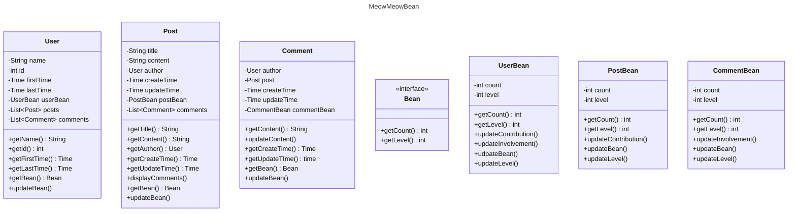

# Design

```mermaid
---
title: MeowMeowBean
---
classDiagram
    class User
    User : -String name
    User : -int id
    User : -Time firstTime
    User : -Time lastTime
    User : -UserBean userBean
    User : -List~Post~ posts
    User : -List~Comment~ comments
    User : +getName() String
    User : +getId() int
    User : +getFirstTime() Time
    User : +getLastTime() Time
    User : +getBean() Bean
    User : +updateBean()

    class Post
    Post : -String title
    Post : -String content
    Post : -User author
    Post : -Time createTime
    Post : -Time updateTime
    Post : -PostBean postBean
    Post : -List~Comment~ comments
    Post : +getTitle() String
    Post : +getContent() String
    Post : +getAuthor() User
    Post : +getCreateTime() Time
    Post : +getUpdateTime() Time
    Post : +displayComments()
    Post : +getBean() Bean
    Post : +updateBean()
    

    class Comment
    Comment : -User author
    Comment : -Post post
    Comment : -Time createTime
    Comment : -Time updateTime
    Comment : -CommentBean commentBean
    Comment : +getContent() String
    Comment : +updateContent()
    Comment : +getCreateTime() Time
    Comment : +getUpdateTIme() time
    Comment : +getBean() Bean
    Comment : +updateBean()

    class Bean
    <<interface>> Bean
    Bean : +getCount() int
    Bean : +getLevel() int
    
    
    class UserBean
    UserBean : -int count
    UserBean : -int level
    UserBean : +getCount() int
    UserBean : +getLevel() int
    UserBean : +updateContribution()
    UserBean : +updateInvolvement()
    UserBean : +udpateBean()
    UserBean : +updateLevel()
    
    class PostBean
    PostBean : -int count
    PostBean : -int level
    PostBean : +getCount() int
    PostBean : +getLevel() int
    PostBean : +updateContribution()
    PostBean : +updateBean()
    PostBean : +updateLevel()
    
    class CommentBean
    CommentBean : -int count
    CommentBean : -int level
    CommentBean : +getCount() int
    CommentBean : +getLevel() int
    CommentBean : +updateInvolvement()
    CommentBean : +updateBean()
    CommentBean : +updateLevel()
    

```

    

